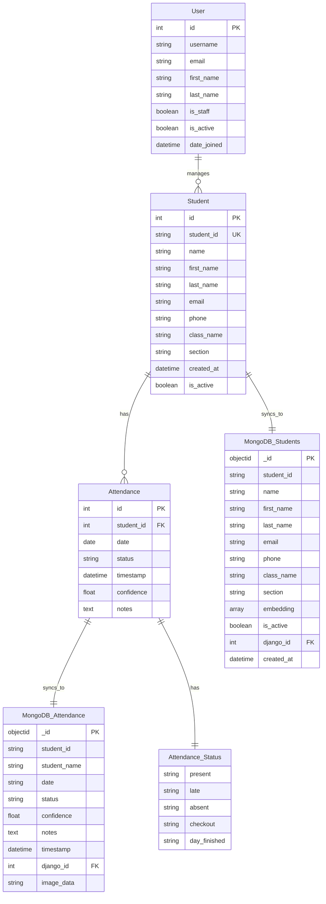

# AI Attendance Manager - Entity Relationship Diagram (ERD)

## Database Architecture Overview

The AI Attendance Manager uses a **hybrid database architecture**:
- **SQLite (Django ORM)**: Primary relational database for core data
- **MongoDB**: Secondary NoSQL database for face embeddings and advanced features

## ERD Diagram



## Database Schema Details

### 1. **Student Model (SQLite)**
```sql
CREATE TABLE student (
    id INTEGER PRIMARY KEY AUTOINCREMENT,
    student_id VARCHAR(50) UNIQUE NOT NULL,
    name VARCHAR(100) NOT NULL,
    first_name VARCHAR(50),
    last_name VARCHAR(50),
    email VARCHAR(254),
    phone VARCHAR(20),
    class_name VARCHAR(50),
    section VARCHAR(20),
    created_at DATETIME NOT NULL,
    is_active BOOLEAN DEFAULT 1
);
```

### 2. **Attendance Model (SQLite)**
```sql
CREATE TABLE attendance (
    id INTEGER PRIMARY KEY AUTOINCREMENT,
    student_id INTEGER NOT NULL,
    date DATE NOT NULL,
    status VARCHAR(15) NOT NULL,
    timestamp DATETIME NOT NULL,
    confidence REAL DEFAULT 0.0,
    notes TEXT,
    FOREIGN KEY (student_id) REFERENCES student (id)
);
```

### 3. **MongoDB Collections**

#### Students Collection
```json
{
  "_id": ObjectId,
  "student_id": "string",
  "name": "string",
  "first_name": "string",
  "last_name": "string",
  "email": "string",
  "phone": "string",
  "class_name": "string",
  "section": "string",
  "embedding": [128 float values],
  "is_active": boolean,
  "django_id": integer,
  "created_at": ISODate
}
```

#### Attendance Collection
```json
{
  "_id": ObjectId,
  "student_id": "string",
  "student_name": "string",
  "date": "string",
  "status": "string",
  "confidence": float,
  "notes": "string",
  "timestamp": ISODate,
  "django_id": integer,
  "image_data": "base64_string"
}
```

## Key Features

### **Hybrid Architecture Benefits:**
1. **SQLite**: Relational integrity, ACID compliance, Django ORM support
2. **MongoDB**: Face embeddings storage, flexible schema, high-performance queries

### **Data Synchronization:**
- Automatic sync between SQLite and MongoDB
- Face embeddings stored in MongoDB for AI processing
- Django models handle dual-database operations

### **Face Recognition Integration:**
- 128-dimensional face embeddings stored in MongoDB
- Ultra-strict matching threshold (92.98%)
- Proxy prevention through high confidence requirements

### **Attendance Status Flow:**
```
Present (≤ 8:00 AM) → Late (8:00 AM - 2:00 PM) → Day Finished (> 2:00 PM)
```

## API Endpoints

### **Face Detection & Recognition:**
- `POST /api/face-detection/` - Face detection processing
- `POST /api/recognize-student/` - Student recognition and attendance marking
- `GET /api/face-detection/status/` - System status check

### **Attendance Management:**
- `GET /api/attendance/initialize/` - Initialize daily attendance
- `GET /api/attendance/summary/` - Get attendance summary
- `POST /api/attendance/manual-mark/` - Manual attendance marking

## Security Features

1. **Proxy Prevention**: Ultra-strict face matching (92.98% threshold)
2. **Time Restrictions**: No scanning after 2:00 PM
3. **Duplicate Prevention**: One attendance record per student per day
4. **Unregistered Face Detection**: Blocks unknown faces

## Technology Stack

- **Backend**: Django 4.x, Python 3.x
- **Database**: SQLite (primary), MongoDB (secondary)
- **AI/ML**: face_recognition, OpenCV, NumPy
- **Frontend**: HTML5, JavaScript, Bootstrap, WebRTC
- **APIs**: RESTful JSON APIs

