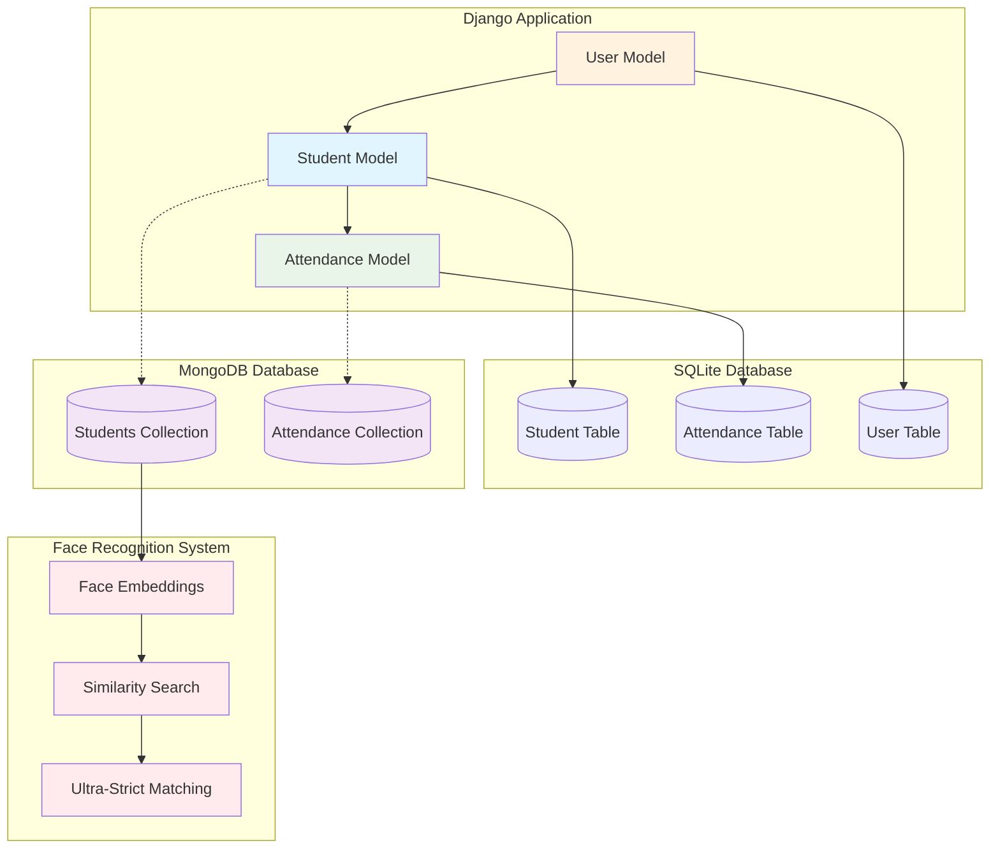
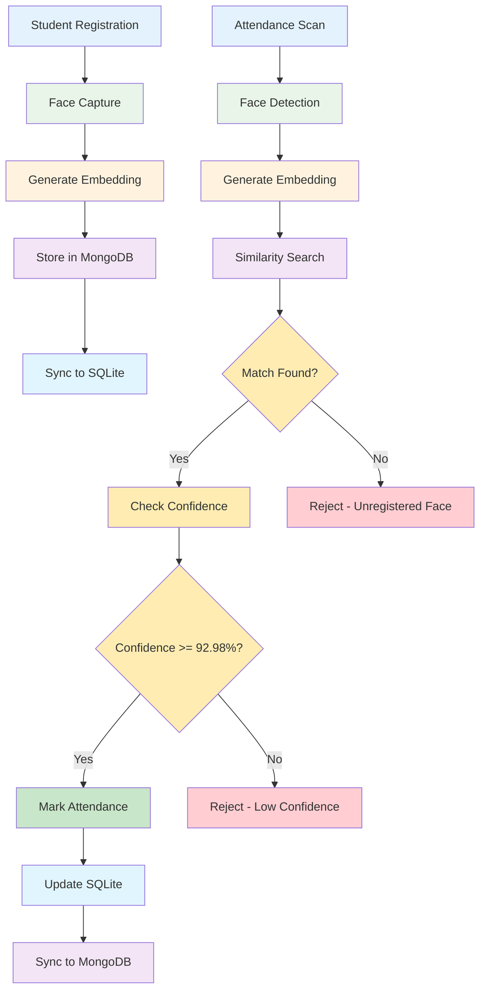
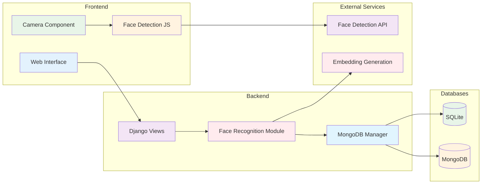
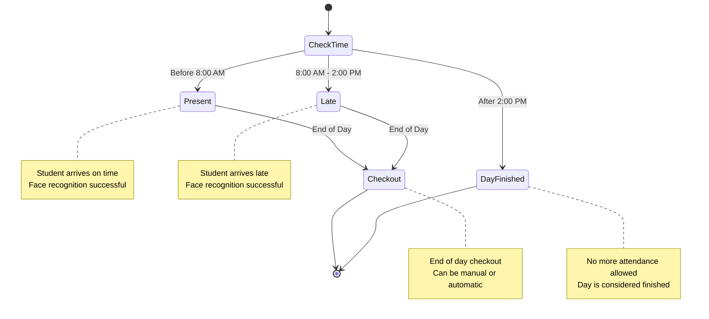
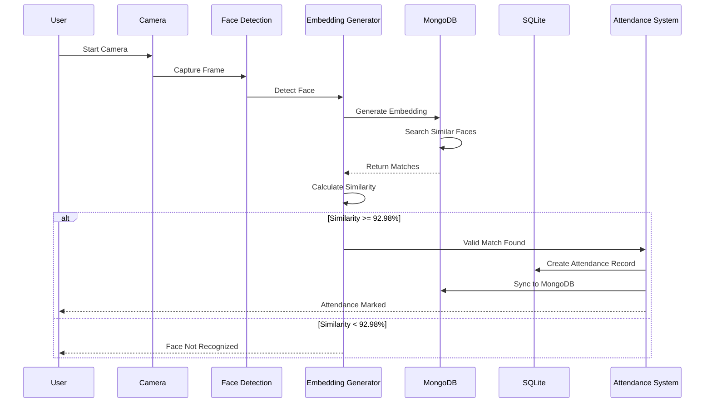

# AI Attendance Manager - Graphical ER Diagram

## Visual Entity Relationship Diagram

```mermaid
erDiagram
    %% Main Django Models
    Student {
        int id PK "Primary Key"
        string student_id UK "Unique Student ID"
        string name "Full Name"
        string first_name "First Name"
        string last_name "Last Name"
        string email "Email Address"
        string phone "Phone Number"
        string class_name "Class/Grade"
        string section "Section"
        datetime created_at "Created Date"
        boolean is_active "Active Status"
    }

    Attendance {
        int id PK "Primary Key"
        int student_id FK "Foreign Key to Student"
        date date "Attendance Date"
        string status "Status: present/late/absent/checkout/day_finished"
        datetime timestamp "Timestamp"
        float confidence "Recognition Confidence"
        text notes "Additional Notes"
    }

    User {
        int id PK "Primary Key"
        string username UK "Username"
        string email "Email"
        string first_name "First Name"
        string last_name "Last Name"
        boolean is_staff "Staff Status"
        boolean is_active "Active Status"
        datetime date_joined "Join Date"
    }

    %% MongoDB Collections
    MongoDB_Students {
        objectid _id PK "MongoDB ObjectId"
        string student_id UK "Student ID"
        string name "Student Name"
        string first_name "First Name"
        string last_name "Last Name"
        string email "Email"
        string phone "Phone"
        string class_name "Class"
        string section "Section"
        array embedding "Face Embedding Vector"
        boolean is_active "Active Status"
        int django_id "Django Student ID"
        datetime created_at "Created Date"
        datetime updated_at "Updated Date"
    }

    MongoDB_Attendance {
        objectid _id PK "MongoDB ObjectId"
        string student_id "Student ID"
        string student_name "Student Name"
        string date "Attendance Date"
        string status "Attendance Status"
        float confidence "Confidence Score"
        text notes "Notes"
        string image_data "Base64 Image Data"
        datetime timestamp "Timestamp"
        int django_id "Django Attendance ID"
        datetime created_at "Created Date"
        datetime updated_at "Updated Date"
    }

    %% Relationships
    Student ||--o{ Attendance : "has attendance records"
    User ||--o{ Student : "manages students"
    
    %% MongoDB Sync (dotted lines for data synchronization)
    Student -.-> MongoDB_Students : "syncs face data"
    Attendance -.-> MongoDB_Attendance : "syncs attendance data"
```

## Database Architecture Overview



## Data Flow Diagram



## System Architecture



## Attendance Status Flow



## Face Recognition Process



## Key Features Summary

### 🔐 Security Features
- **Ultra-Strict Face Recognition**: 92.98% similarity threshold
- **Proxy Attack Prevention**: Rejects unregistered faces
- **Confidence Levels**: VERY_HIGH, HIGH, LOW_CONFIDENCE
- **Session Management**: Secure authentication

### 📊 Data Management
- **Hybrid Database**: SQLite + MongoDB
- **Automatic Synchronization**: Real-time data sync
- **Face Embeddings**: 128-dimensional vectors
- **Image Storage**: Base64 encoded attendance photos

### ⏰ Time-Based Logic
- **Present**: Before 8:00 AM
- **Late**: 8:00 AM - 2:00 PM  
- **Day Finished**: After 2:00 PM
- **Checkout**: End of day process

### 🎯 Performance Optimizations
- **MongoDB Indexing**: Fast similarity searches
- **Caching Strategy**: Optimized face recognition
- **Query Optimization**: Efficient data retrieval
