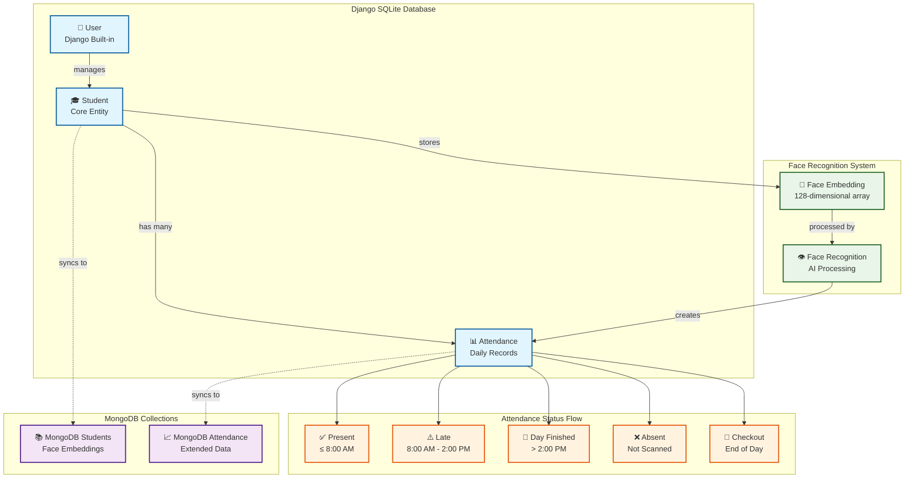
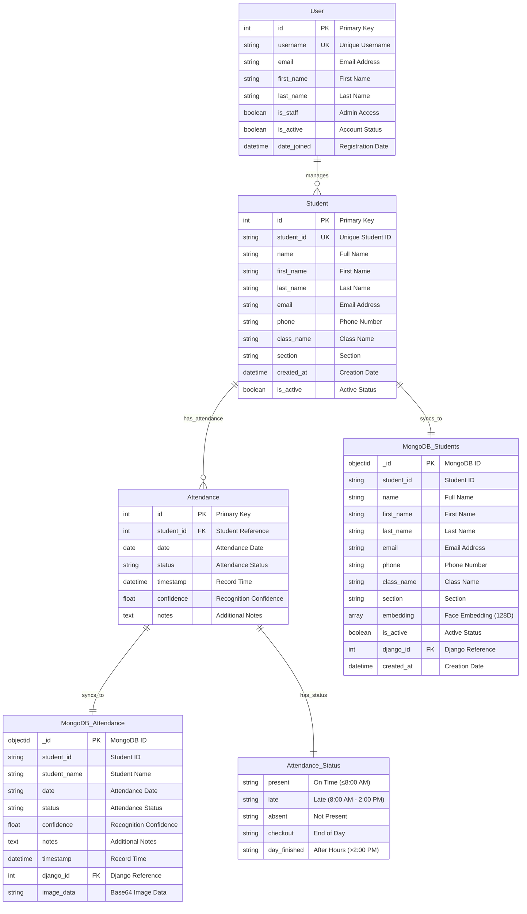
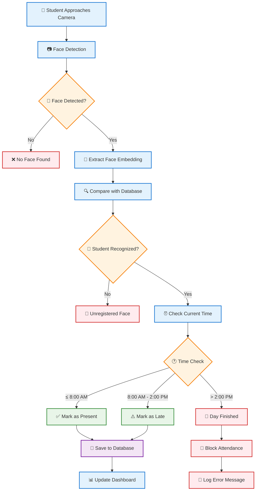

# AI Attendance Manager - Visual ERD Diagram

## Interactive Database Schema

## Detailed Entity Relationship Diagram

## System Architecture Flow

## Database Schema Summary

### **Core Tables (SQLite)**
- **User**: Django authentication system
- **Student**: Student information and face data references
- **Attendance**: Daily attendance records with timestamps

### **MongoDB Collections**
- **Students**: Face embeddings and extended student data
- **Attendance**: Image data and additional attendance information

### **Key Features**
- 🔄 **Dual Database Sync**: Automatic synchronization between SQLite and MongoDB
- 🧠 **AI Integration**: 128-dimensional face embeddings for recognition
- ⏰ **Time-based Logic**: Automatic status assignment based on scan time
- 🛡️ **Security**: Proxy prevention and unregistered face detection
- 📊 **Real-time Updates**: Live dashboard with attendance statistics

### **API Endpoints**
- `/api/face-detection/` - Face detection processing
- `/api/recognize-student/` - Student recognition and attendance marking
- `/api/attendance/summary/` - Attendance statistics
- `/api/attendance/initialize/` - Daily attendance initialization

This visual ERD shows the complete database architecture, data flow, and system relationships in your AI Attendance Manager project.

