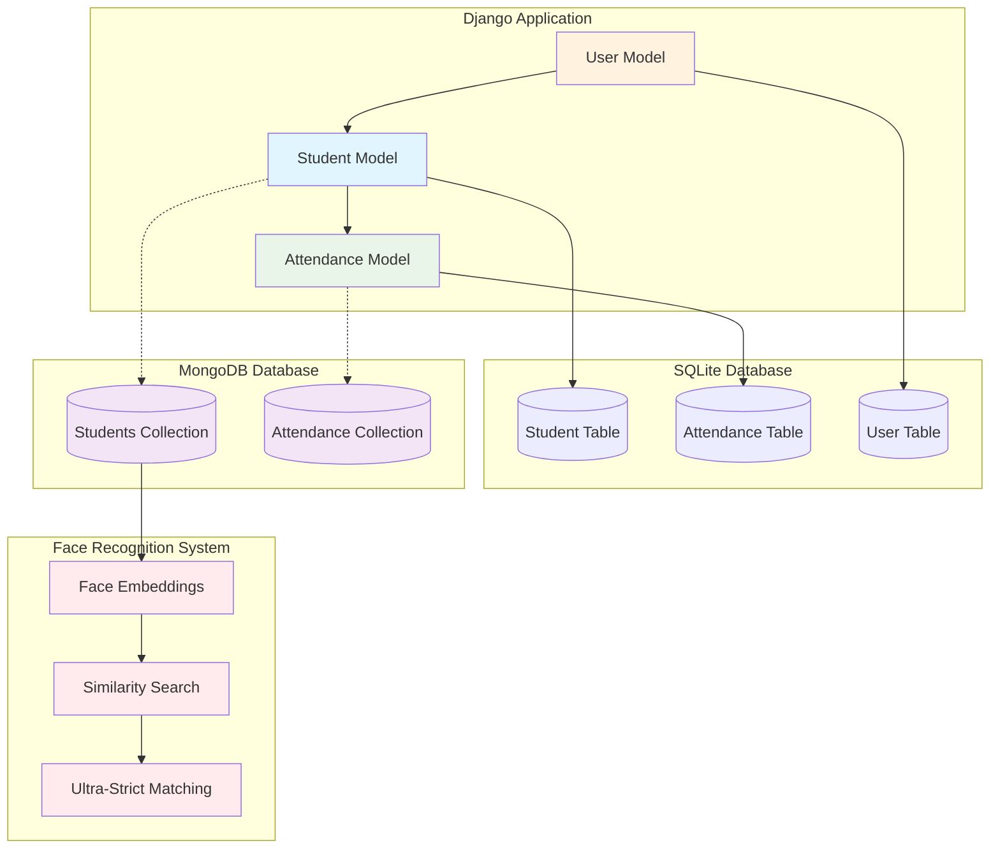
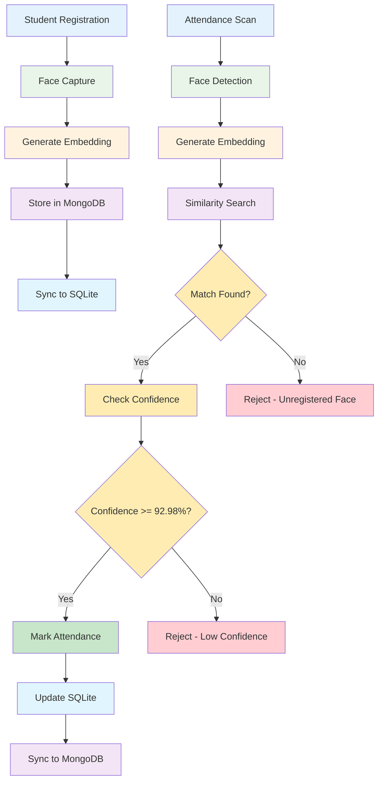
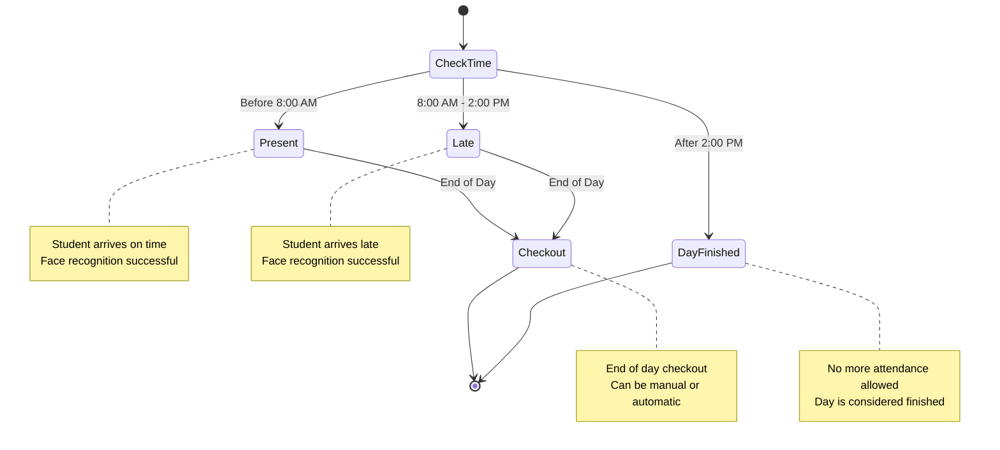
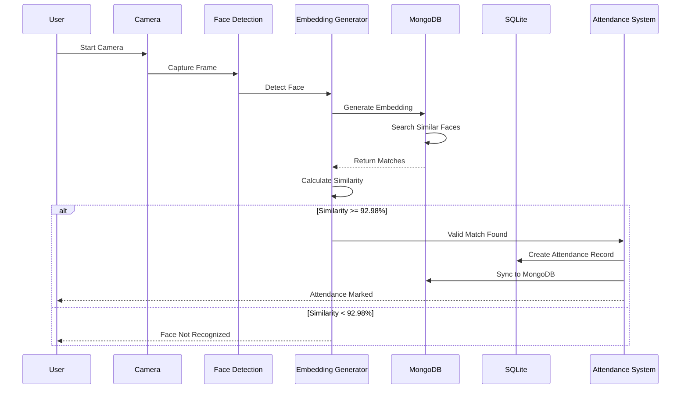
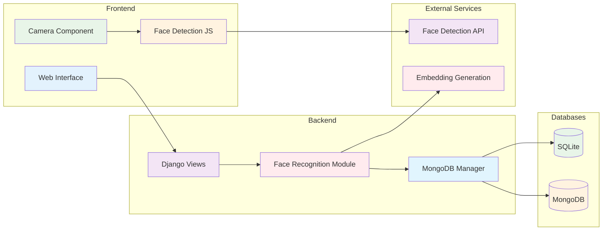

# AI Attendance Manager - Mermaid ER Diagram

## Complete Entity Relationship Diagram

```mermaid
erDiagram
    %% Django Models (SQLite Database)
    Student {
        int id PK "Auto-increment primary key"
        string student_id UK "Unique student identifier"
        string name "Full name of student"
        string first_name "First name"
        string last_name "Last name"
        string email "Email address"
        string phone "Phone number"
        string class_name "Class/grade"
        string section "Section/division"
        datetime created_at "Record creation timestamp"
        boolean is_active "Active status flag"
    }

    Attendance {
        int id PK "Auto-increment primary key"
        int student_id FK "Foreign key to Student"
        date date "Attendance date"
        string status "present/late/absent/checkout/day_finished"
        datetime timestamp "Attendance timestamp"
        float confidence "Face recognition confidence score"
        text notes "Additional notes"
    }

    User {
        int id PK "Auto-increment primary key"
        string username UK "Unique username"
        string email "Email address"
        string first_name "First name"
        string last_name "Last name"
        boolean is_staff "Staff status"
        boolean is_active "Active status"
        datetime date_joined "Account creation date"
    }

    %% MongoDB Collections
    MongoDB_Students {
        objectid _id PK "MongoDB ObjectId"
        string student_id UK "Student identifier (sync with Django)"
        string name "Student name"
        string first_name "First name"
        string last_name "Last name"
        string email "Email address"
        string phone "Phone number"
        string class_name "Class/grade"
        string section "Section/division"
        array embedding "Face recognition embedding vector"
        boolean is_active "Active status"
        int django_id "Reference to Django Student.id"
        datetime created_at "Record creation timestamp"
        datetime updated_at "Last update timestamp"
    }

    MongoDB_Attendance {
        objectid _id PK "MongoDB ObjectId"
        string student_id "Student identifier"
        string student_name "Student name (denormalized)"
        string date "Attendance date"
        string status "Attendance status"
        float confidence "Recognition confidence"
        text notes "Additional notes"
        string image_data "Base64 encoded attendance image"
        datetime timestamp "Attendance timestamp"
        int django_id "Reference to Django Attendance.id"
        datetime created_at "Record creation timestamp"
        datetime updated_at "Last update timestamp"
    }

    %% Primary Relationships
    Student ||--o{ Attendance : "has many"
    User ||--o{ Student : "manages"
    
    %% MongoDB Sync Relationships (dotted lines for data synchronization)
    Student -.-> MongoDB_Students : "syncs to"
    Attendance -.-> MongoDB_Attendance : "syncs to"
```

## Database Architecture Overview



## Data Flow Diagram



## Attendance Status Flow



## Face Recognition Process



## System Architecture



## Key Features Summary

### 🔐 Security Features
- **Ultra-Strict Face Recognition**: 92.98% similarity threshold
- **Proxy Attack Prevention**: Rejects unregistered faces
- **Confidence Levels**: VERY_HIGH, HIGH, LOW_CONFIDENCE
- **Session Management**: Secure authentication

### 📊 Data Management
- **Hybrid Database**: SQLite + MongoDB
- **Automatic Synchronization**: Real-time data sync
- **Face Embeddings**: 128-dimensional vectors
- **Image Storage**: Base64 encoded attendance photos

### ⏰ Time-Based Logic
- **Present**: Before 8:00 AM
- **Late**: 8:00 AM - 2:00 PM
- **Day Finished**: After 2:00 PM
- **Checkout**: End of day process

### 🎯 Performance Optimizations
- **MongoDB Indexing**: Fast similarity searches
- **Caching Strategy**: Optimized face recognition
- **Query Optimization**: Efficient data retrieval
